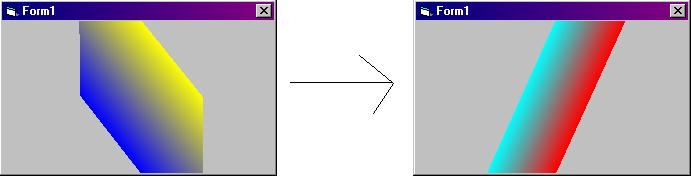



## Rainbow Rotator

### Description

This is so cool! A rainbow of yellow to blue rotate in a 3D format, and magically turns into a rainbow of light blue and green. This is not a skin! And doesn't need any API's to work. This is basic, but gives greate results. You can use it as an into to a game or even a program. If you click on the form, you will be able to stop the rainbow at any time. Look at screen shot. :-)
 
### More Info
 

             |
---                |---
**Submitted On**   |2002-06-03 18:37:16
**By**             |[Computer Controller](https://github.com/Planet-Source-Code/PSCIndex/blob/master/ByAuthor/computer-controller.md)
**Level**          |Advanced
**User Rating**    |4.6 (37 globes from 8 users)
**Compatibility**  |VB 4\.0 \(32\-bit\), VB 5\.0, VB 6\.0
**Category**       |[Graphics](https://github.com/Planet-Source-Code/PSCIndex/blob/master/ByCategory/graphics__1-46.md)
**World**          |[Visual Basic](https://github.com/Planet-Source-Code/PSCIndex/blob/master/ByWorld/visual-basic.md)
**Archive File**   |[Rainbow\_Ro89729632002\.zip](https://github.com/Planet-Source-Code/computer-controller-rainbow-rotator__1-35446/archive/master.zip)

